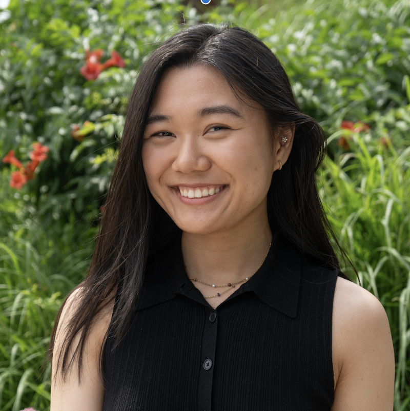

<h1>Hi there! I’m Tori Lee </h1>

<em>(she / her / hers)</em>

🎓 NYU Class of 2026

💼 Interested in FinTech

📚 B.S. in Business & Technology Management (Finance Concentration) + Math Minor

🌸 Currently working on: <strong>this page and updating my rest of my github!</strong>

---

<h2>💌 About This Page</h2>

I made this little corner of the internet to <b>showcase my work</b>, share what I’m <b>learning</b>, 
and connect with others who share my passions in <b>finance, data, event management,</b> and <b>retail</b>. 💕

---

<h2>🌸 About Me</h2>

  
<b>📖 Academics</b>

  

  Currently majoring in <b>Business & Technology Management (Finance)</b> with a <b>Math minor</b> at NYU.  
  I’ve explored everything from <b>Calculus & Linear Algebra</b> ➝ <b>Physics & Bio</b> ➝ <b>Finance, Accounting, Ops, Management Science</b> ➝ <b>Python & Circuits</b>.   
  Basically... a little of everything 🌈
  

  
<b>💎 Leadership</b>

  <ul>
    <li>IEE at NYU — President (2023–24), Secretary (2022–23)</li>
    <li>Pride Month @ NYU — VP (2022–23), Treasurer (2021–22)</li>
    <li>oSTEM — Historian (2022–23)</li>
    <li>FBLA — NY State Secretary & Chapter President (2018–19)</li>
    
 other extracurriculars...

    <li> Tandon Consulting Club, Women in Business and Entrepreneurship (WIBE), Forte Foundation</li>
  </ul>

  
<b>🛠 Skills</b>

  
<b>
 Excel (PivotTables, Forecasting, Dashboards), SQL, Power BI, QuickBooks, Python, MATLAB, HTML, C, Microsoft Office Suite, Google Workspace, 

  <b>Expertise in:</b> Retail + F&B Sales, Bookkeeping, Data Analytics, Event Mgmt

  
<b>📄 Resume</b>

  

    <a href="YOUR_FINANCE_RESUME_LINK.pdf">💼 Finance Resume</a>  
    <a href="YOUR_MASTER_RESUME_LINK.pdf">📜 Master Resume</a>
  

  

---

<h2>🌷 Personal</h2>

<b>What inspires me?</b>

<ol>
  

  <li>My surroundings, the community, and the people around me ✨</li>
  <li>Keeping an open mind + learning from every space 🌎</li>
  <li>Immersing myself in cultures & nature — I love to travel 🌸</li>
</ol>

<b>In my free time:</b>

<ul>
  

  <li>💕Spending time with/meeting people </li>
  <li>🌱Advocating for mental health </li>
  <li>🎧Podcasts & TEDx talks while doing chores </li>
    <li>🏔Staying Active: Yoga, swimming, snowboarding </li>
    <li> Playing video games </li>
</ul>

---

  <h2>🌟 Let’s Connect!</h2>
  
tori.lee@nyu.edu • LinkedIn • Projects • Always open to collaboration 💌

